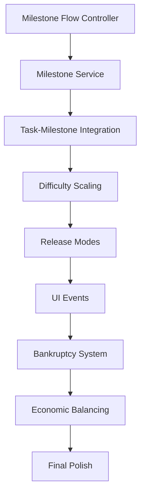

# План реализации недостающих функций

## Обзор

Документ содержит детальный план реализации функций, необходимых для соответствия проекта AI Specification из `.roo/instructions.md`. План разделен на фазы с указанием приоритетов и зависимостей.

## Фаза 1: Критический Core Loop (2-3 недели)

### 1.1 Milestone Flow Controller
**Цель**: Реализовать основной игровой цикл WORK → Milestone Completion → Milestone Result → SHOP PHASE → следующий Sprint

**Файлы для создания**:
- `Assets/_root/Scripts/MilestoneSystem/MilestoneFlowController.cs`
- `Assets/_root/Scripts/MilestoneSystem/MilestoneFlowState.cs`

**Ключевая логика**:
```csharp
public class MilestoneFlowController : IController
{
    public enum FlowState
    {
        Working,        // Игрок выполняет задачи
        Completed,      // Все задачи выполнены
        ShowingResult,  // Показ результатов Milestone
        ShopPhase,      // Фаза магазина
        Transitioning   // Переход к следующему Sprint
    }
    
    // Основной метод управления циклом
    public void UpdateFlowState()
    {
        switch (_currentState)
        {
            case FlowState.Working:
                CheckMilestoneCompletion();
                break;
            case FlowState.Completed:
                ShowMilestoneResult();
                break;
            case FlowState.ShowingResult:
                WaitForResultConfirmation();
                break;
            case FlowState.ShopPhase:
                WaitForShopCompletion();
                break;
            case FlowState.Transitioning:
                StartNextMilestone();
                break;
        }
    }
}
```

**Интеграция**:
- Интегрировать с [`ProjectProgressService`](Assets/_root/Scripts/Progress/ProjectProgressService.cs)
- Использовать [`LocalEvents`](Assets/_root/Scripts/GlobalStateMachine/LocalEvents.cs) для уведомлений
- Управлять переходами между состояниями

### 1.2 Complete Milestone Service
**Цель**: Полная реализация системы Milestone с DaysLimit, генерацией задач и проверкой завершения

**Файлы для создания**:
- `Assets/_root/Scripts/MilestoneSystem/MilestoneService.cs`
- `Assets/_root/Scripts/MilestoneSystem/MilestoneConfig.cs`
- `Assets/_root/Scripts/MilestoneSystem/MilestoneGenerator.cs`

**Ключевая логика**:
```csharp
public class MilestoneService : IController
{
    public struct MilestoneData
    {
        public int MilestoneIndex;
        public ProjectStage Stage;
        public int DaysLimit;
        public int MoneyReward;
        public List<DevTask> RequiredTasks;
        public bool IsCompleted;
        public int DaysSpent;
    }
    
    public MilestoneData GenerateMilestone(ProjectStage stage, int milestoneIndex)
    {
        var config = GetMilestoneConfig(stage, milestoneIndex);
        return new MilestoneData
        {
            DaysLimit = config.DaysLimit,
            MoneyReward = config.MoneyReward,
            RequiredTasks = GenerateTasksForMilestone(stage, milestoneIndex),
            // ...
        };
    }
    
    public bool CheckMilestoneCompletion(MilestoneData milestone)
    {
        return milestone.RequiredTasks.All(task => task.IsCompleted) 
               && milestone.DaysSpent <= milestone.DaysLimit;
    }
}
```

**Зависимости**:
- [`TaskService`](Assets/_root/Scripts/Task/TaskService.cs) для генерации задач
- [`DifficultyScalingService`](Assets/_root/Scripts/Progress/DifficultyScalingService.cs) для балансировки

### 1.3 Task-Milestone Integration
**Цель**: Интегрировать систему задач с Milestone, реализовать проверку навыков и систему времени

**Модификации существующих файлов**:
- Модифицировать `Assets/_root/Scripts/Task/TaskService.cs`
- Обновить `Assets/_root/Scripts/EmployeeLogic/Company.cs`

**Новая логика**:
```csharp
public class TaskService : IController
{
    public void AssignTaskToEmployee(DevTask task, Employee employee)
    {
        // Проверка соответствия навыков
        if (!employee.HasRequiredSkill(task.RequiredSkill))
        {
            Debug.LogWarning($"Employee {employee.Name} lacks required skill {task.RequiredSkill}");
            return;
        }
        
        // Назначение задачи
        employee.CurrentTask = task;
        task.AssignedEmployee = employee;
        task.Status = TaskStatus.InProgress;
    }
    
    public void UpdateTaskProgress(float deltaTime)
    {
        foreach (var task in _activeTasks)
        {
            if (task.Status == TaskStatus.InProgress && task.AssignedEmployee != null)
            {
                // Увеличение прогресса на основе навыков сотрудника
                var skillLevel = task.AssignedEmployee.GetSkillLevel(task.RequiredSkill);
                task.Progress += deltaTime * skillLevel * TaskProgressMultiplier;
                
                if (task.Progress >= 1.0f)
                {
                    CompleteTask(task);
                }
            }
        }
    }
}
```

## Фаза 2: Сложность и Релиз (2-3 недели)

### 2.1 Difficulty Scaling System
**Цель**: Реализовать эскалацию сложности в соответствии с прогрессом игрока

**Файлы для создания**:
- `Assets/_root/Scripts/Progress/DifficultyScalingService.cs`
- `Assets/_root/Scripts/Progress/DifficultyConfig.cs`

**Ключевая логика**:
```csharp
public class DifficultyScalingService : IController
{
    public struct DifficultyParameters
    {
        public int TaskCountMultiplier;
        public float DaysLimitModifier;
        public float SalaryMultiplier;
        public float RewardMultiplier;
        public float TaskComplexityModifier;
    }
    
    public DifficultyParameters GetDifficultyForProgress(int gameIndex, ProjectStage stage, int milestoneIndex)
    {
        var baseDifficulty = GetBaseDifficulty(stage);
        var gameProgressMultiplier = 1.0f + (gameIndex * 0.2f); // +20% за каждую игру
        var milestoneProgressMultiplier = 1.0f + (milestoneIndex * 0.1f); // +10% за каждый milestone
        
        return new DifficultyParameters
        {
            TaskCountMultiplier = Mathf.RoundToInt(baseDifficulty.TaskCountMultiplier * gameProgressMultiplier),
            DaysLimitModifier = baseDifficulty.DaysLimitModifier / milestoneProgressMultiplier,
            SalaryMultiplier = baseDifficulty.SalaryMultiplier * gameProgressMultiplier,
            RewardMultiplier = baseDifficulty.RewardMultiplier * gameProgressMultiplier,
            TaskComplexityModifier = baseDifficulty.TaskComplexityModifier * milestoneProgressMultiplier
        };
    }
}
```

### 2.2 Publisher/Indie Release Modes
**Цель**: Реализовать два режима релиза с разными механиками

**Модификации существующих файлов**:
- Расширить `Assets/_root/Scripts/Progress/ReleaseResultService.cs`
- Обновить `Assets/_root/Scripts/Progress/ReleaseResultController.cs`

**Новая логика**:
```csharp
public class ReleaseResultService
{
    public enum ReleaseMode
    {
        Publisher,
        Indie
    }
    
    public ReleaseResultData GenerateReleaseResult(ProgressData data, Dictionary<DevTaskType, int> completedTasks, ReleaseMode mode)
    {
        var baseResult = CalculateBaseReleaseResult(data, completedTasks);
        
        switch (mode)
        {
            case ReleaseMode.Publisher:
                return ApplyPublisherModifiers(baseResult);
            case ReleaseMode.Indie:
                return ApplyIndieModifiers(baseResult, data.MarketingLevel);
            default:
                return baseResult;
        }
    }
    
    private ReleaseResultData ApplyPublisherModifiers(ReleaseResultData baseResult)
    {
        return new ReleaseResultData
        {
            // ... базовые поля
            PublisherCut = Mathf.RoundToInt(baseResult.Revenue * 0.3f), // 30% издателю
            NetProfit = baseResult.Revenue - baseResult.PublisherCut,
            UnitsSold = Mathf.RoundToInt(baseResult.UnitsSold * 1.2f), // +20% стабильности
            // ...
        };
    }
    
    private ReleaseResultData ApplyIndieModifiers(ReleaseResultData baseResult, int marketingLevel)
    {
        var marketingMultiplier = 1.0f + (marketingLevel * 0.1f); // +10% за уровень маркетинга
        var riskFactor = Random.Range(0.7f, 1.5f); // Риск: от -30% до +50%
        
        return new ReleaseResultData
        {
            // ... базовые поля
            PublisherCut = 0, // Нет издателя
            NetProfit = Mathf.RoundToInt(baseResult.Revenue * marketingMultiplier * riskFactor),
            UnitsSold = Mathf.RoundToInt(baseResult.UnitsSold * marketingMultiplier * riskFactor),
            // ...
        };
    }
}
```

### 2.3 Marketing System
**Цель**: Реализовать систему маркетинга для indie режима

**Файлы для создания**:
- `Assets/_root/Scripts/Marketing/MarketingService.cs`
- `Assets/_root/Scripts/Marketing/MarketingUpgrade.cs`

## Фаза 3: UI и Events (1-2 недели)

### 3.1 Complete UI Event Integration
**Цель**: Реализовать все требуемые UI события из спецификации

**Модификации существующих файлов**:
- Обновить `Assets/_root/Scripts/GlobalStateMachine/LocalEvents.cs`
- Модифицировать соответствующие контроллеры

**Обязательные события**:
```csharp
// В LocalEvents.cs
public event Action<float> OnMilestoneProgressChanged;
public void TriggerMilestoneProgressChanged(float progress) => OnMilestoneProgressChanged?.Invoke(progress);

public event Action OnMilestoneResultWindow;
public void TriggerMilestoneResultWindow() => OnMilestoneResultWindow?.Invoke();

public event Action OnReleaseWindow;
public void TriggerReleaseWindow() => OnReleaseWindow?.Invoke();

public event Action<ProjectStage> OnStageChanged;
public void TriggerStageChanged(ProjectStage stage) => OnStageChanged?.Invoke(stage);

public event Action OnGameReleased;
public void TriggerGameReleased() => OnGameReleased?.Invoke();
```

### 3.2 Milestone Progress UI
**Цель**: Создать UI для отображения прогресса Milestone

**Файлы для создания**:
- `Assets/_root/Scripts/UI/Milestone/MilestoneProgressView.cs`
- `Assets/_root/Scripts/UI/Milestone/MilestoneProgressController.cs`

## Фаза 4: Экономика и Балансировка (2 недели)

### 4.1 Bankruptcy Detection
**Цель**: Реализовать обнаружение банкротства и обработку рестарта

**Файлы для создания**:
- `Assets/_root/Scripts/Progress/BankruptcyService.cs`

**Ключевая логика**:
```csharp
public class BankruptcyService : IController
{
    public bool CheckBankruptcy(ProgressData data)
    {
        return data.Money < 0;
    }
    
    public void HandleBankruptcy(ProgressData data)
    {
        // Сохранение навыков главного героя
        var heroSkills = GetHeroSkills(data);
        
        // Сброс прогресса игры
        ResetGameProgress(data);
        
        // Восстановление навыков героя
        RestoreHeroSkills(data, heroSkills);
        
        // Уведомление о банкротстве
        _localEvents.TriggerBankruptcy();
    }
}
```

### 4.2 Economic Pressure Balancing
**Цель**: Настроить экономическое давление в соответствии со спецификацией

**Модификации существующих файлов**:
- Обновить `Assets/_root/Scripts/Progress/EconomyService.cs`

### 4.3 Shop Offer Dynamic Updates
**Цель**: Реализовать динамическое обновление предложений в магазине

**Модификации существующих файлов**:
- Обновить `Assets/_root/Scripts/GlobalStateMachine/ShopState.cs`
- Модифицировать shop контроллеры

## Фаза 5: Оптимизация и Полировка (1-2 недели)

### 5.1 Performance Optimizations
- Оптимизировать обновления UI
- Кэшировать часто используемые данные
- Оптимизировать garbage collection

### 5.2 Meta Progress Optimization
- Улучшить сохранение/загрузку мета-прогресса
- Оптимизировать рестарты

### 5.3 Testing and Bug Fixes
- Комплексное тестирование всех систем
- Исправление багов
- Балансировка игровых параметров

## Зависимости и порядок реализации



## Ресурсы и оценка времени

### Требуемые ресурсы:
- **Senior Developer**: 1 человек на полный день
- **QA Tester**: 0.5 человека на фазе тестирования
- **Unity Developer**: Для UI оптимизаций

### Общая оценка времени:
- **Фаза 1**: 2-3 недели
- **Фаза 2**: 2-3 недели  
- **Фаза 3**: 1-2 недели
- **Фаза 4**: 2 недели
- **Фаза 5**: 1-2 недели

**Итого**: 8-12 недель полной реализации

## Риски и митигация

### Высокие риски:
1. **Сложность интеграции с существующим кодом**
   - Митигация: Постепенная рефакторизация, backward compatibility

2. **Балансировка игровых параметров**
   - Митигация: Раннее прототипирование, playtesting

3. **Производительность UI**
   - Митигация: Профилирование на ранних этапах

### Средние риски:
1. **Изменение требований**
   - Митигация: Гибкая архитектура, модульный дизайн

2. **Технические ограничения Unity**
   - Митигация: Исследование альтернативных подходов

## Критерии успеха

### Функциональные критерии:
- ✅ Полный Core Loop работает как в спецификации
- ✅ Все три стадии разработки реализованы
- ✅ Эскалация сложности работает корректно
- ✅ Оба режима релиза функциональны
- ✅ Система банкротства и мета-прогресс работают

### Качественные критерии:
- ✅ Игра ощущается "chill" без излишнего наказания
- ✅ Экономическое давление ощущается, но не подавляет
- ✅ Прогресс ощущается значимым
- ✅ UI отзывчив и понятен

## Заключение

Данный план обеспечивает поэтапную реализацию всех необходимых функций с минимальными рисками и четкими критериями успеха. Приоритет на Core Loop обеспечивает работоспособность основной механики на ранних этапах.